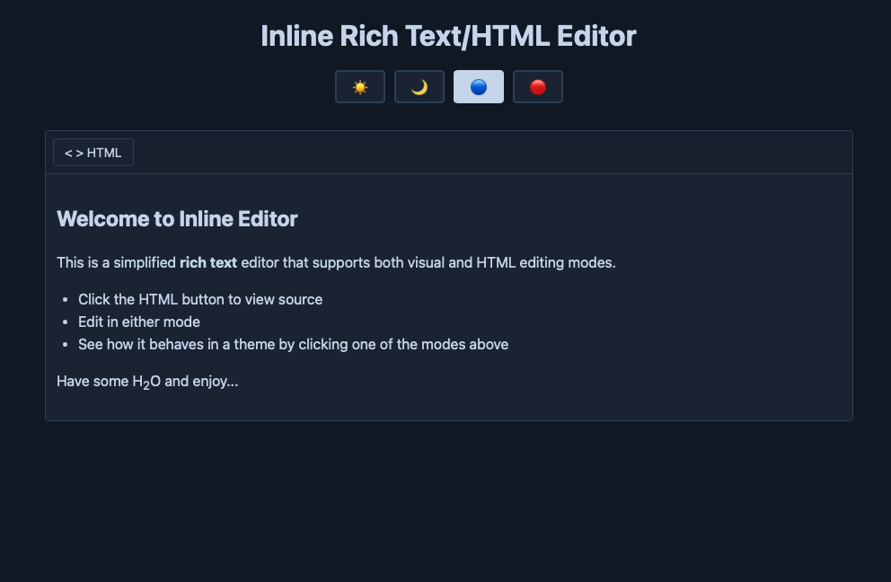

# Inline HTML Editor

A lightweight, themeable React component for inline HTML editing with visual and code modes. Perfect for applications that need night mode support and simple content editing.


## Features

- Toggle between visual (WYSIWYG) and HTML source code modes
- Fully customizable background and foreground colors for dark/light mode
- Ctrl/Cmd+Click to open links in new tabs while editing
- Proper rendering of lists, headings, bold, italic, images and more
- Support for subscript and superscript formatting
- Code and pre elements with monospace font and background styling
- Smooth typing with stable cursor positioning
- Easy to integrate with minimal configuration
- Pure React implementation using contentEditable

## Demo



## Installation

### Using in Your Project

1. Copy `InlineEditor.jsx` to your project's components folder
2. Import and use it in your React application

```bash
# If you want to run the demo
git clone https://github.com/YOUR_USERNAME/inline-editor.git
cd inline-editor
npm install
npm run dev
```

## Usage

### Basic Example

```jsx
import InlineEditor from "./components/InlineEditor";

function MyApp() {
  const [content, setContent] = useState("<p>Hello World</p>");

  return (
    <InlineEditor
       # Inline HTML Editor

      A lightweight, themeable React component for inline HTML editing with visual and code modes. Perfect for applications that need night mode support and simple content editing.

      

      ## Features

      - Toggle between visual (WYSIWYG) and HTML source code modes
      - Fully customizable background and foreground colors for dark/light mode
      - Ctrl/Cmd+Click to open links in new tabs while editing
      - Proper rendering of lists, headings, bold, italic, images and more
      - Support for subscript and superscript formatting
      - Code and pre elements with monospace font and background styling
      - Smooth typing with stable cursor positioning
      - Easy to integrate with minimal configuration
      - Pure React implementation using contentEditable

      ## Demo

      

      ## Installation

      ### Using in Your Project

      1. Copy `InlineEditor.tsx` (or `InlineEditor.jsx`) to your project's components folder
      2. Import and use it in your React application

      ```bash
      # If you want to run the demo
      git clone https://github.com/YOUR_USERNAME/inline-editor.git
      cd inline-editor
      npm install
      npm run dev
      ```

      ## Usage

      ### Basic Example

      ```jsx
      import { useState } from 'react';
      import InlineEditor from './components/InlineEditor';

      function MyApp() {
        const [content, setContent] = useState('<p>Hello World</p>');

        return (
          <InlineEditor
            initialContent={content}
            onChange={(newContent) => setContent(newContent)}
            onBlur={(newContent) => {
              // Save to database when user clicks away (works in both modes)
              saveToDatabase(newContent);
            }}
          />
        );
      }
      ```

      ### With Theme Support

      ```jsx
      import { useState } from 'react';
      import InlineEditor from './components/InlineEditor';

      function MyApp() {
        const [isDarkMode, setIsDarkMode] = useState(false);

        const theme = isDarkMode
          ? {
              backgroundColor: '#1e1e1e',
              foregroundColor: '#e0e0e0',
              borderColor: '#444444',
            }
          : {
              backgroundColor: '#ffffff',
              foregroundColor: '#000000',
              borderColor: '#cccccc',
            };

        return (
          <InlineEditor
            initialContent="<p>Start typing...</p>"
            backgroundColor={theme.backgroundColor}
            foregroundColor={theme.foregroundColor}
            borderColor={theme.borderColor}
            onChange={(content) => console.log(content)}
          />
        );
      }
      ```

      ### Advanced Example with Custom Styling

      ```jsx
      <InlineEditor
        initialContent="<h1>My Document</h1><p>Content here...</p>"
        backgroundColor="#2b2520"
        foregroundColor="#e8dcc8"
        borderColor="#4a3f35"
        className="my-custom-editor"
        style={{ maxWidth: '800px', margin: '0 auto' }}
        onChange={(newContent) => {
          // Save to backend, update state, etc.
          saveContent(newContent);
        }}
      /> 
      ```

      ## Props

      | Prop              | Type     | Default                         | Description                                                      |
      | ----------------- | -------- | ------------------------------- | ---------------------------------------------------------------- |
      | `initialContent`  | string   | `'<p>Start typing here...</p>'` | Initial HTML content to display                                  |
      | `backgroundColor` | string   | `'#ffffff'`                     | Background color of the editor                                   |
      | `foregroundColor` | string   | `'#000000'`                     | Text color                                                       |
      | `borderColor`     | string   | `'#cccccc'`                     | Border color                                                     |
      | `className`       | string   | `''`                            | Additional CSS class for the container                           |
      | `style`           | object   | `{}`                            | Additional inline styles for the container                       |
      | `onChange`        | function | `undefined`                     | Callback fired when content changes in HTML mode: `(content: string) => void` |
      | `onBlur`          | function | `undefined`                     | Callback fired when editor loses focus (both visual and HTML modes): `(content: string) => void` |

      ## Features in Detail

      ### Visual Mode

      - Type naturally with rendered HTML
      - Click to position cursor
      - `Cmd/Ctrl`+`Click` links to open in new tab
      - Proper rendering of:
        - Headings (h1-h3)
        - Unordered and ordered lists (ul, ol)
        - Bold, italic text
        - Links with underline styling
        - Images (responsive, max-width: 100%)
        - Subscript and superscript
        - Inline code and code blocks with monospace font
        - Paragraphs with spacing

      ### HTML Mode

      - Edit raw HTML source code
      - Monospace font for better readability
      - Syntax-friendly textarea
      - Switch back to see rendered result

      ### Keyboard Shortcuts

      - Use `Cmd/Ctrl` & `Click` Open links in new tab (visual mode)
      - Switch modes using the toolbar button

      ## Styling

      The editor applies default styling to HTML elements. You can customize the appearance by:

      1. Using props: `backgroundColor`, `foregroundColor`, `borderColor`
      2. Custom className: Add your own CSS class
      3. Inline styles: Pass additional styles via `style` prop

      ### Example Custom Styles

      ```css
      .my-custom-editor .editor-content a {
        color: #ff6600;
        text-decoration: none;
      }

      .my-custom-editor .editor-content ul {
        list-style-type: square;
      }
      ```

      ## Browser Support

      - Chrome/Edge (latest)
      - Firefox (latest)
      - Safari (latest)

      ## Technical Details

      ### How It Works

      The component uses React's `contentEditable` attribute for visual editing mode:

      - Initial content is set once on mount via `useEffect`
      - Content is not controlled after mount to prevent cursor jumping
      - Mode switching manually updates the DOM
      - HTML mode uses a controlled textarea

      ### Why No Cursor Jumping?

      Unlike many contentEditable implementations, this component:

      - Avoids unnecessary re-renders during typing
      - Only updates innerHTML when switching modes
      - Uses refs instead of state for the visual editor content
      - No event handlers that trigger React updates while typing

      ## Best Practices: Getting Editor Content

      This component supports three primary ways to read editor content. Use whichever fits your application:

      - `onChange` — fires when the HTML textarea (HTML mode) changes. Useful for live updates while editing source.
      - `onBlur` — fires when the editor (visual or HTML) loses focus. Use this to persist content when users finish editing.
      - `ref` (imperative) — call `getContent()` to read the current HTML from the editor at any time (e.g. on form submit).

      Recommended approach: use the `ref` API for programmatic reads combined with `onBlur` for user-driven saves. This avoids unnecessary React updates during typing in visual mode while still letting you persist reliably.

      ### Example: TypeScript (preferred for apps using forms)

      ```tsx
      import { useRef, useState } from 'react';
      import InlineEditor from './InlineEditor';
      import type { InlineEditorHandle } from './src/types';

      function ArticleForm() {
        const editorRef = useRef<InlineEditorHandle | null>(null);
        const [savedHtml, setSavedHtml] = useState('');

        function handleSubmit(e: React.FormEvent) {
          e.preventDefault();
          // Imperative read just before submit
          const html = editorRef.current?.getContent() ?? '';
          // Sanitize on server or use a client sanitizer before sending
          setSavedHtml(html);
          // sendToServer(html)
        }

        return (
          <form onSubmit={handleSubmit}>
            <InlineEditor ref={editorRef} initialContent="<p>Start</p>" />
            <button type="submit">Save</button>
          </form>
        );
      }
      ```

      ### Example: Debounced Saves (client-side)

      If you want to autosave while editing, debounce `onChange` or the server call. Avoid updating React state on every input in visual mode — prefer `onChange` (HTML mode) or a periodic read via `ref`.

      ```jsx
      import { useRef, useCallback } from 'react';
      import InlineEditor from './InlineEditor';
      import debounce from 'lodash/debounce';

      function AutoSaveEditor() {
        const editorRef = useRef(null);

        const save = useCallback(
          debounce(() => {
            const html = editorRef.current?.getContent() ?? '';
            // sendToServer(html)
          }, 1000),
          []
        );

        return <InlineEditor ref={editorRef} onChange={save} onBlur={save} />;
      }
      ```

      ### Security: sanitize before storing or rendering

      The editor does not sanitize HTML. Always sanitize on the server side (or use a trusted client-side sanitizer) before storing or rendering user content to prevent XSS.

      ## Example: Capturing Content Changes

      ```jsx
      import { useState } from 'react';
      import InlineEditor from './components/InlineEditor';

      function DocumentEditor() {
        const [content, setContent] = useState('<p>Start typing...</p>');

        return (
          <InlineEditor
            initialContent={content}
            onChange={(newContent) => {
              // Fires when editing HTML source
              setContent(newContent);
              console.log('HTML mode change:', newContent);
            }}
            onBlur={(newContent) => {
              // Fires when user clicks away from visual or HTML editor
              setContent(newContent);
              console.log('Visual mode blur:', newContent);
            }}
          />
        );
      }
      ```

      ## FAQ

      **Q: Can I add toolbar buttons for formatting?**  
      A: The component is intentionally minimal. You can extend it by using `document.execCommand()` for basic formatting or add custom buttons that manipulate the content.

      **Q: How do I get the current content programmatically?**  
      A: Use the `onChange` callback or, for programmatic reads, call the `getContent()` method on the component ref (see examples above).

      **Q: Can I use this in a form?**  
      A: Yes! Use the `ref` to read content at submit time or keep a saved copy via `onBlur`.

      **Q: Does it sanitize HTML?**  
      A: No. You should sanitize user input on your backend before storing/displaying it.

      ## Contributing

      Contributions are welcome! Please feel free to submit a Pull Request.

      ## License

      MIT License - feel free to use this in your projects!

      ## Changelog

      ### Version 1.0.0

      - Initial release
      - Visual and HTML editing modes
      - Theme customization
      - Clickable links with Cmd/Ctrl+Click
      - Proper HTML element styling (headings, lists, bold, italic, images)
      - Subscript and superscript support
      - Code and pre element styling with monospace font
      - No cursor jumping issues
